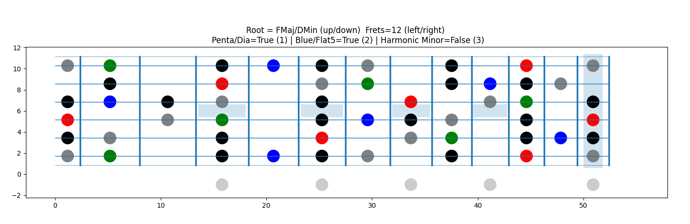

# PyFreboard
Generate + save guitar fretboard scale diagrams using MatplotLib. Supports transposition, harmonic minor, bluesy blue notes, pentatonic/diatonic options, etc

# How run?
Download the repo, then run the `fretbord.exe` in the `dist` folder
Mac/Linux peeps, you'll have to build/run it through python

## How build?
### Windows
`c:\wherever\python.exe fretboard.py`
or
`pip install pyinstaller`
`pyinstaller --onefile fretboard.py`
### mac / linux
`chmod +x fretboard.py`
`py fretboard.py`

## What do?
`Up` and `Down` to transpose a semitone either way
`Left` and `Right` to add or remove frets
`1` Toggle pentatonic / Diatonic e.g. Perfect 4th/Maj7th (or 2nd & 6th degrees of minor scale)
`2` Toggle drawing a flat 5th (blue note)
`3` Toggle drawing a sharp 7th (harmonic minor)

All the window functions beyond that belong to matplotlib

## Doesn't work!
`pip install matplotlib`

